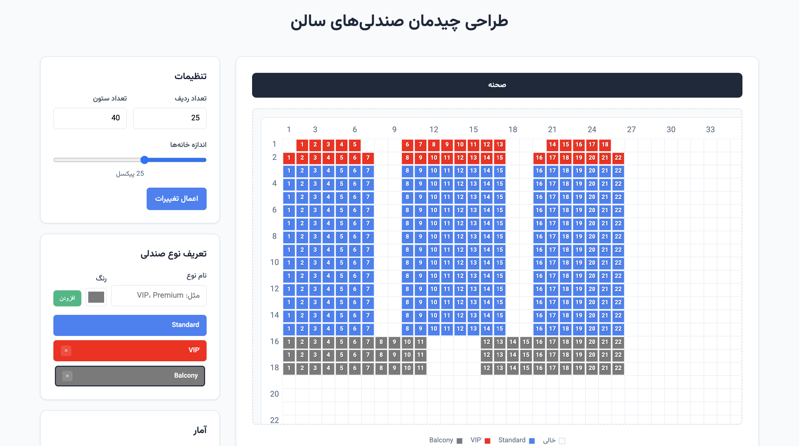

# 🎭 Seat Matrix Designer | طراحی چیدمان صندلی‌های سالن

[](https://developer.mozilla.org/en-US/docs/Web/HTML)
[](https://developer.mozilla.org/en-US/docs/Web/CSS)
[](https://developer.mozilla.org/en-US/docs/Web/JavaScript)
[](https://choosealicense.com/licenses/mit/)
[](https://developer.mozilla.org/en-US/docs/Web/API/Canvas_API)

**A Web-Based Theater Seating Layout Designer & Management Tool**  
**ابزار تحت وب برای طراحی و مدیریت چیدمان صندلی‌های سالن**

---

## 📸 Demo | نمایش



*Interactive theater seating layout designer in action*

---

## 📋 Table of Contents | فهرست مطالب

- [🎯 Project Overview](#-project-overview--نمای-کلی-پروژه)
- [✨ Key Features](#-key-features--ویژگی‌های-کلیدی)
- [🚀 Quick Start](#-quick-start--راه‌اندازی-سریع)

---

## 🎯 Project Overview | نمای کلی پروژه

**Seat Matrix Designer** is a powerful, web-based theater seating layout designer and management system built with vanilla JavaScript, HTML5 Canvas, and modern CSS. This tool empowers venue managers, architects, and event planners to create, customize, and manage seating arrangements for auditoriums, cinemas, theaters, amphitheaters, and other entertainment venues.

**طراح ماتریس صندلی** یک ابزار تحت وب برای طراحی و مدیریت چیدمان صندلی‌های سالن است که با JavaScript، HTML5 Canvas و CSS ساخته شده است. این ابزار به مدیران سالن، معماران و برنامه‌ریزان رویداد امکان ایجاد، سفارشی‌سازی و مدیریت چیدمان صندلی‌ها برای سالن‌های نمایش، سینما، تئاتر، آمفی‌تئاتر و سایر مکان‌های تفریحی را می‌دهد.

### 🎪 Perfect for | مناسب برای:
- **Theater Venues** | سالن‌های تئاتر
- **Cinema Complexes** | مجموعه‌های سینمایی  
- **Concert Halls** | سالن‌های کنسرت
- **Conference Centers** | مراکز همایش
- **Educational Auditoriums** | آمفی‌تئاترهای آموزشی
- **Event Planning** | برنامه‌ریزی رویداد

---

## ✨ Key Features | ویژگی‌های کلیدی

### 🎨 **Visual Design & Interface | طراحی بصری و رابط کاربری**
- **Interactive Canvas Editor** | ویرایشگر تعاملی
- **Customizable Grid Size** | اندازه شبکه قابل تنظیم (15-40px)

### 🪑 **Advanced Seat Management | مدیریت پیشرفته صندلی‌ها**
- **Multiple Seat Types** | انواع مختلف صندلی (VIP, Premium, Standard)
- **Color-coded Categories** | دسته‌بندی با کد رنگی
- **Automatic Numbering** | شماره‌گذاری خودکار
- **Bulk Selection Tools** | انتخاب گروهی
- **Drag & Drop Interface** | رابط کشیدن و رها کردن

### 📊 **Productivity Tools | ابزارها**
- **Single Click Selection** | انتخاب با کلیک تکی
- **Area Selection** | انتخاب ناحیه‌ای
- **Real-time Statistics** | آمار

---

## 🚀 Quick Start | راه‌اندازی سریع

### Method 1: Direct Browser Launch | روش ۱: اجرای مستقیم در مرورگر

```bash
# Clone the repository | کپی مخزن
git clone https://github.com/Omidpanah/seat-matrix-designer.git

# Navigate to project directory | رفتن به پوشه پروژه
cd seat-matrix-designer

# Open in browser | باز کردن در مرورگر
open index.html
```

### Method 2: Local Server | روش ۲: سرور محلی

```bash
# Using Python 3 | استفاده از پایتون ۳
python -m http.server 8000

# Using Node.js | استفاده از Node.js
npx serve .

# Using PHP | استفاده از PHP
php -S localhost:8000

# Then visit | سپس مراجعه کنید به
# http://localhost:8000
```

### Method 3: Live Server (VS Code) | روش ۳: لایو سرور

1. Install **Live Server** extension | نصب افزونه **Live Server**
2. Right-click `index.html` | کلیک راست روی `index.html`
3. Select "Open with Live Server" | انتخاب "Open with Live Server"

---

## 🌟 **Support the Project | حمایت از پروژه**

If you find this project helpful, please consider:  
اگر این پروژه برای شما مفید بود، لطفاً از آن حمایت کنید:

⭐ **Star this repository** | به پروژه ستاره دهید <br>
🐛 **Report issues** | مشکلات را گزارش دهید<br>
💡 **Suggest features** | ایده‌های خود را پیشنهاد کنید<br>
🤝 **Contribute code** | در توسعه مشارکت کنید<br>
📢 **Share with others** | پروژه را با دیگران به اشتراک بگذارید<br>

---

**Version**: 1.0.0 | **نسخه**: 1.0.0